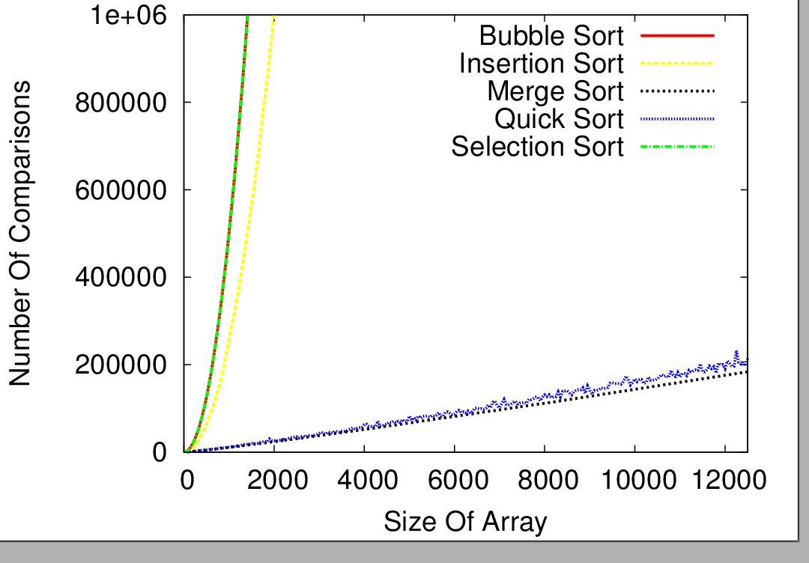

# Comparison Of Sorting Algorithms

## Description

In this project, the efficiency of five algorithms was tested on a randomly generated data set. The number of comparisons required by each algorithm were counted against the size of the input array. Then a graph was plotted using GNU-Plot and Okular. Also, report and presentation were made using Latex.

The above image depicts the no. of comparisons by 5 algorithms against the size of input array.

## Technologies Used

* C - for running the Algorithms
* Shell Scripting - for automating the process for different input size.
* GNU-Plot and Okular - to plot the data on the graph and view it.
* Latex - to make the report and presentation.
